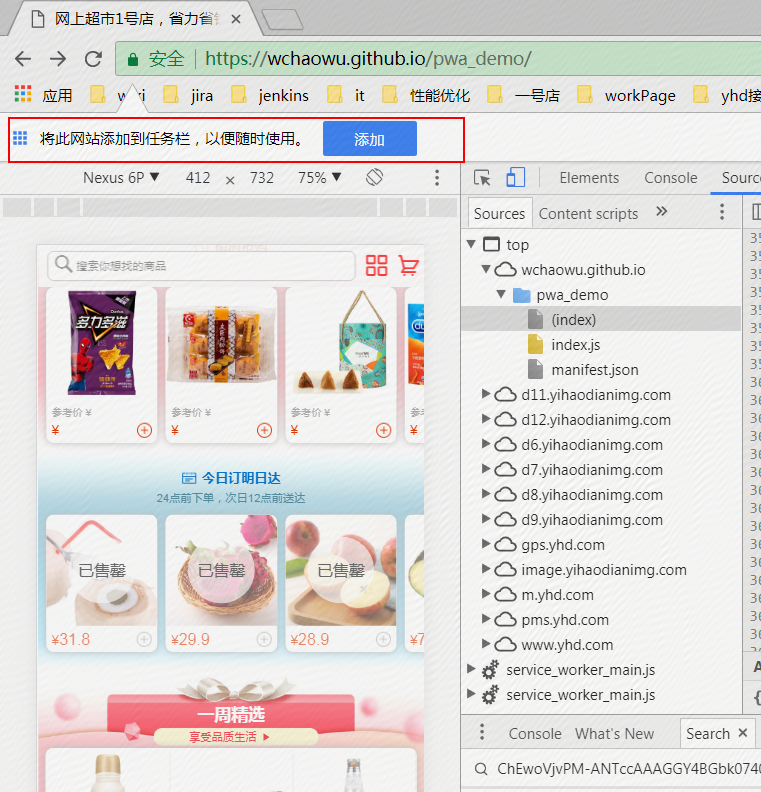
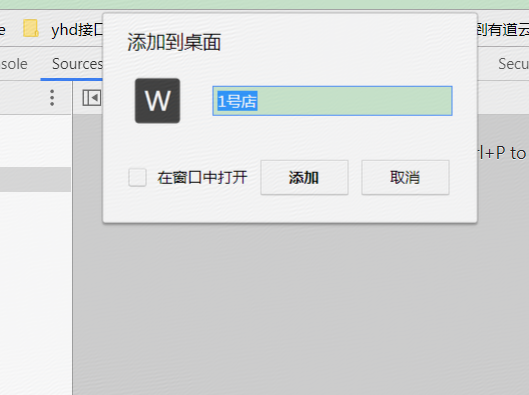

## 什么是Progressive Web Apps [官方文档](https://developers.google.com/web/fundamentals/getting-started/)

Progressive Web Apps（PWA，渐进式增强 WEB 应用），并且在其主要产品上进行了深入的实践
* 不依赖网络连接 – 通过 Service Workers 可以在离线或者网速极差的环境下工作。
* 类原生应用 – 有像原生应用般的交互和导航给用户原生应用般的体验，因为它是建立在 app shell model 上的。
* 持续更新 – 受益于 Service Worker 的更新进程，应用能够始终保持更新。
* 安全 – 通过 HTTPS 来提供服务来防止网络窥探，保证内容不被篡改。
* 可发现 – 得益于 W3C manifests 元数据和 Service Worker 的登记，让搜索引擎能够找到 web 应用。
* 再次访问 – 通过消息推送等特性让用户再次访问变得容易。
* 可安装 – 允许用户保留对他们有用的应用在主屏幕上，不需要通过应用商店。
* 可连接性 – 通过 URL 可以轻松分享应用，不用复杂的安装即可运行。

### Service Worker

    *后台消息传递
    *网络代理，转发请求，伪造响应
    *离线缓存
    *消息推送

    [使用 Service Workers]https://developer.mozilla.org/zh-CN/docs/Web/API/Service_Worker_API/Using_Service_Workers)

### 开发步骤

1. 添加 manifest.json 文件, 生成 Android 主屏打开的网页加载页面
2. 编写 Service Worker 脚本处理缓存, 更快读取缓存
3. 服务端渲染, 用 App Shell 带来效果, 然后动态加载

###当前demo

[yhd_Demo](https://wchaowu.github.io/pwa_demo/)   
[manifest.json](https://wchaowu.github.io/pwa_demo/manifest.json)

   
 

=======
### 更多

[pwa 站点](https://pwa.rocks/)

